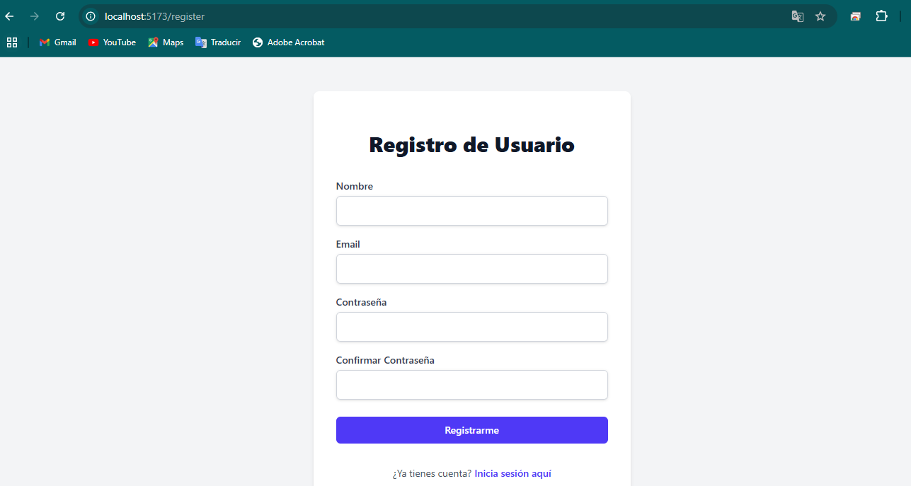

# DOCUMENTACIÓN DEL PROYECTO

# 1. Introducción

## 1.1 Propósito

El Sistema de Gestión de Reportes de Accidentes Urbanos (SGRAU) facilita la recopilación, administración y validación de incidentes urbanos, promoviendo transparencia y respuesta eficiente de las autoridades.

## 1.2 Alcance

El SGRAU permitirá:

- Registrar accidentes con ubicación, evidencia fotográfica y descripción.
- Validar y gestionar reportes para asegurar su autenticidad.
- Administrar reportes y usuarios con control de estatus.

## 1.3 Definiciones y Abreviaciones

- **SGRAU**: Sistema de Gestión de Reportes de Accidentes Urbanos.
- **Usuario**: Persona que accede al sistema.
- **Administrador**: Usuario con permisos avanzados de gestión.
- **Reporte**: Registro de un accidente urbano.
- **Estatus**: Estado del reporte (Reportado, En Proceso, Resuelto).
- **Reputación**: Métrica basada en la veracidad de los reportes.
- **Validación**: Revisión de un reporte para confirmar su autenticidad.
- **Incidente**: Evento urbano reportado.

Este documento define los requerimientos para la implementación del sistema.

# 2. Requerimientos del sistema

## 2.1 Requerimientos Funcionales

### RF1: Autenticación de Usuarios

- El sistema deberá permitir el acceso mediante credenciales únicas (usuario y contraseña).
    - Deberá haber diferentes niveles de acceso: administradores y usuarios

### RF2: Gestión de Usuarios

- El sistema permitirá el registro, inicio de sesión, edición y eliminación de usuarios.
- Se podrán visualizar los datos de contacto y estado de los usuarios.
- Los administradores podrán restringir, eliminar y bloquear usuarios con comportamiento inapropiado.
- Los usuarios podrán reportar publicaciones y usuarios.

### RF3: Reporte de Incidentes

- El sistema permitirá reportar incidentes desde su cuenta proporcionando:
    - Evidencia fotográfica
    - Descripción detallada
    - Estado del Incidente
    - Ubicación
- Los administradores podrán eliminar publicaciones que no cumplan con las reglas de la comunidad.
- Si más de una persona reporta el mismo incidente habrá un histórico recopilatorio del mismo incidente.

### RF4: Gestión de Incidentes

- Se podrá reportar, editar y eliminar incidentes del tablón de incidentes.
- Cualquier usuario/administrador podrá modificar el estado de los incidentes (Reportado, En Proceso, Resuelto) si provee suficientes pruebas (evidencia fotográfica).

### RF5: Interacción con incidentes

- Los usuarios podrán visualizar mediante etiquetas el tipo de cada incidente. (Etiquetas tales como baches, iluminarias, etc.)
- Se podrán visualizar el estatus de los incidentes en un mapa interactivo (Reportado, En Proceso, Resuelto).

### RF6: Búsqueda y Consulta de Incidentes

- El usuario podrá buscar incidentes mediante ubicaciones, descripción y tipo.
- Se podrá filtrar por:
    - Tipo de Incidente
    - Antigüedad
    - Cercanía

### RF7: Notificación y Alerta de Incidentes

- Los usuarios recibirán notificaciones si hay cambios en el estado de su reporte.
- Se emitirán notificaciones sobre incidentes cercanos a los usuarios.

## 2.2 Requerimientos No Funcionales

### RNF1: Seguridad

- El sistema deberá cifrar las contraseñas de los usuarios.
- El sistema permite registrar una pregunta de seguridad en caso de que el usuario olvide su contraseña.
- El administrador al momento de cambiar de estatus un incidente, deberá de proporcionar el ID de dicho incidente, además de su pin de cuatro dígitos.

### RNF2: Rendimiento

- El sistema deberá soportar al menos 50 usuarios de manera simultánea.
- El sistema deberá tardar menos de 5 segundos en mostrar el reporte en el mapa interactivo.

### RNF3: Disponibilidad

- El sistema deberá estar disponible al menos el 99% del tiempo.

### RNF4: Usabilidad

- La interfaz deberá ser intuitiva, usable y amigable con las personas analfabetas.

# 3. Casos de Uso

## 3.1 CU: Agregar un Usuario

### 3.1.1 Detalles

- Descripción: El usuario ingresa la información necesaria para crear un nuevo usuario.
- Precondición: Tener datos en formato correcto y válidos.
- Postcondición: El sistema necesita agregar el usuario a la base de datos y mostrar un mensaje de confirmación.

### 3.1.2 Prototipo de Interfaz del Usuario

## 3.2 CU: Iniciar Sesión

### 3.2.1. Detalles

- Descripción: El usuario ingresa sus credenciales para iniciar sesión en la aplicación y tener acceso a las funcionalidades
- Precondición: No tener una sesión activa en el dispositivo al momento de iniciar sesión. Tener una cuenta previamente creada y las credenciales correctas para acceder.
- Postcondición: El sistema comienza sesión del usuario cuyas credenciales fueron presentadas al iniciar sesión. Se le da acceso a las funcionalidades restringidas a uso único con sesión activa.

### 3.2.2 Prototipo de Interfaz del Usuario

## 3.3 CU: Cerrar Sesión

### 3.3.1 Detalles

- Descripción: El usuario cierra su sesión activa en la aplicación para finalizar su acceso al sistema
- Precondición: Tener una sesión activa en el sistema (token válido)
- Postcondición: El sistema invalida el token del usuario, impidiendo el acceso a funcionalidades protegidas hasta un nuevo inicio de sesión.

### 3.3.2 Prototipo de Interfaz del Usuario

- En la esquina superior derecha, al iniciar sesión, nos deja como opción cerrar la sesión.

## 3.4 CU: Obtener Información del Usuario Autenticado

### 3.4.1. Detalles

- Descripción: El usuario solicita ver su información personal almacenada en el sistema.
- Precondición: Tener una sesión activa en el sistema (token válido).
- Postcondición: El sistema muestra la información del usuario autenticado sin exponer datos sensibles como contraseñas completas.

### 3.4.2 Prototipo de Interfaz del Usuario

- En este caso, nos muestra la información de nuestro usuario.

## 3.5 CU: Actualizar Información del Usuario Autenticado

### 3.5.1 Detalles

- Descripción: El usuario ingresa la información que solicita cambiar, y posteriormente puede visualizar los cambios.
- Precondición: Estar loggeado en el sistema.
- Postcondición: El sistema necesita mostrar los datos actualizados del usuario y necesita mostrar un mensaje de confirmación.

### 3.5.2 Prototipo de Interfaz del Usuario

- Aunque sea una pantalla similar a la 3.4.2, desde la misma pantalla nos deja modificar detalles del usuario.

# 4. Flujo - Casos de Uso

## 4.1 CU: Agregar un Usuario

> 4.1.1 Caso de Uso - Caso Normal
> 

| Pasos | Actor | Sistema |
| --- | --- | --- |
| Paso 1 | El usuario que se encuentra en el menú de inicio, presiona en el botón de registrarse. | El sistema muestra el formulario a llenar con los datos solicitados. |
| Paso 2 | El usuario ingresa los datos que se solicita. | El sistema verifica el formato de los datos y que estén correctos. |
| Paso 3 | El usuario da clic en “Registrarse”. | El sistema despliega la vista de usuario creado y manda los datos a la base de datos. |

> 4.1.2 Caso de Uso - Caso Alternativo
> 

| Pasos | Actor | Sistema |
| --- | --- | --- |
| Paso 1 | El usuario que se encuentra en el menú de inicio, presiona en el botón de registrarse. | El sistema muestra el formulario a llenar con los datos solicitados. |
| Paso 2 | El usuario ingresa los datos que se solicita. | El sistema verifica el formato de los datos y que sean válidos.
En caso de que algún dato no cumpla con el formato, |
| Paso 3 | El usuario da clic en “Registrarse”. | El sistema pide verificar las casillas en rojo del formulario y pide datos correctos. |
| Paso 4 | El usuario ve reflejado las casillas donde debe revisar los datos. | El sistema espera el formulario completo. |

> 4.1.3 Caso de Uso - Caso Alternativo 2
> 

| Pasos | Actor | Sistema |
| --- | --- | --- |
| Paso 1 | El usuario que se encuentra en el menú de inicio, presiona en el botón de registrarse. | El sistema muestra el formulario a llenar con los datos solicitados. |
| Paso 2 | El usuario ingresa los datos que se solicita. | El sistema verifica el formato de los datos y que estén correctos. |
| Paso 3 | El usuario da clic en “Registrarse”. | El sistema verifica que el correo no esté ya registrado en la base de datos. |
| Paso 4 | El usuario ve un mensaje de error, que dice “correo ya asociado a un usuario existente” | El sistema muestra el mensaje de error y redirige de vuelta al menú principal. |

## 4.2 CU: Iniciar Sesión

> 4.2.1. Caso de Uso - Caso normal
> 

| Pasos | Actor | Sistema |
| --- | --- | --- |
| Paso 1 | El usuario que se encuentra en el menú de inicio, presiona en el botón de iniciar sesión. | El sistema muestra el formulario a llenar con los datos solicitados. |
| Paso 2 | El usuario ingresa los datos que se solicita. Presiona botón de iniciar sesión | El sistema consulta la base de datos y verifica que los datos existan y sean correctos |
| Paso 3 | El usuario inicia sesión | Se da acceso a las funcionalidades completas |

> 4.2.2. Caso de Uso - Caso alternativo, datos incorrectos
> 

| Pasos | Actor | Sistema |
| --- | --- | --- |
| Paso 1 | El usuario que se encuentra en el menú de inicio, presiona en el botón de iniciar sesión. | El sistema muestra el formulario a llenar con los datos solicitados. |
| Paso 2 | El usuario ingresa los datos que se solicita. Presiona botón de iniciar sesión | El sistema consulta la base de datos y verifica que los datos existan y sean correctos |
| Paso 3 | El usuario no inicia sesión por datos incorrectos | Se da la opción de reintentar iniciar sesión |

> 4.2.3. Caso de Uso - Caso alternativo, recuperar contraseña
> 

| Pasos | Actor | Sistema |
| --- | --- | --- |
| Paso 1 | El usuario que se encuentra en el menú de inicio, presiona en el botón de recuperar contraseña. | El sistema solicita un correo electrónico para enviar el cambio de contraseña. |
| Paso 2 | El usuario recibe el correo (si existe la cuenta) e ingresa una nueva contraseña. Da clic en el botón aceptar | El sistema cambia la contraseña vieja por la nueva en caso de que la contraseña tenga un formato válido, caso contrario pide una diferente que sea válida |
| Paso 3 |  | El sistema da la opción de regresar al menú de iniciar sesión. |

## 4.3 CU: Cerrar Sesión

> 4.3.1 Caso de Uso - Caso Normal
> 

| Pasos | Actor | Sistema |
| --- | --- | --- |
| Paso 1 | El usuario, mientras tiene una sesión activa, presiona el botón "Cerrar Sesión". | El sistema recibe la solicitud con el token de autenticación. |
| Paso 2 | El usuario espera la confirmación. | El sistema invalida el token del usuario en la base de datos. |
| Paso 3 | El usuario ve el mensaje "Sesión finalizada". | El sistema redirige al usuario a la pantalla de inicio de sesión. |

> 4.3.2 Caso de Uso - Caso Alternativo (Token no enviado)
> 

| Pasos | Actor | Sistema |
| --- | --- | --- |
| Paso 1 | El usuario intenta cerrar sesión sin enviar credenciales. | El sistema detecta la ausencia del token de autenticación. |
| Paso 2 | El usuario ve un mensaje de error. | El sistema devuelve un error 400 (Bad Request) indicando que falta el token. |

> 4.3.3 Caso de Uso - Caso Extraordinario (Múltiples intentos de logout)
> 

| Paso | Actor | Sistema |
| --- | --- | --- |
| Paso 1 | El usuario cierra sesión exitosamente. | El sistema invalida el token del usuario. |
| Paso 2 | El usuario intenta cerrar sesión nuevamente con el mismo token. | El sistema verifica el token y detecta que ya está invalidado. |
| Paso 3 | El usuario ve un mensaje de error. | El sistema devuelve un error 400 indicando que la sesión ya ha sido cerrada.
 |

## 4.4 CU: Obtener Información del Usuario Autenticado

> 4.4.1 Caso de Uso - Caso Normal
> 

| Pasos | Actor | Sistema |
| --- | --- | --- |
| Paso 1 | El usuario con sesión activa solicita ver su información. | El sistema recibe la solicitud con el token de autenticación. |
| Paso 2 | El usuario espera la respuesta. | El sistema valida el token y busca la información del usuario en la base de datos. |
| Paso 3 | El usuario ve su información personal. | El sistema muestra los datos del usuario (id, correo) sin exponer la contraseña completa. |

> 4.4.2 Caso de Uso - Caso Alternativo (Token inválido)
> 

| Pasos  | Actor | Sistema |
| --- | --- | --- |
| Paso 1 | El usuario intenta acceder a su información con un token incorrecto. | El sistema verifica el token en la base de datos. |
| Paso 2 | El usuario ve un mensaje de error de autenticación. | El sistema devuelve un error 401 (Unauthorized) indicando que el token no es válido. |

> 4.4.3 Caso de Uso - Caso Extraordinario (Caída del servidor de base de datos)
> 

| Pasos | Actor | Sistema |
| --- | --- | --- |
| Paso 1 | El usuario solicita ver su información. | El sistema intenta conectarse a la base de datos para validar el token. |
| Paso 2 | El usuario ve un mensaje de error del servidor. | El sistema detecta que la base de datos no está disponible y devuelve un error 503 (Service Unavailable). |
| Paso 3 | El usuario intenta nuevamente más tarde. | El sistema sugiere al usuario intentar nuevamente en unos minutos. |

## 4.5 CU: Actualizar Información del Usuario Autenticado

> 4.5.1 Caso de Uso - Caso Normal
> 

| Pasos | Actor | Sistema |
| --- | --- | --- |
| Paso 1 | El usuario que se encuentra con la sesión activa selecciona el botón de “Actualizar mis Datos”. | El sistema muestra los datos de la pantalla de inicio de sesión, y manda la solicitud. |
| Paso 2 | El usuario ingresa los datos que solicita cambiar. | El sistema despliega la vista donde se alojarán los datos a cambiar y guarda dichos cambios. |
| Paso 3 | El usuario da clic en “Deseo cambiar mis datos” e ingresa su token. | El sistema despliega la vista Modal de “¿Desea cambiar sus datos?” y manda la solicitud para realizar el cambio. |
| Paso 4 | El usuario ve reflejado sus nuevos datos y un mensaje que menciona “Sus datos se han actualizado con éxito”. | El sistema realizó el cambio, se encontró al usuario y desplegó los nuevos datos junto a un mensaje de confirmación. |

> 4.5.2 Caso de Uso - Caso Alternativo
> 

| Pasos | Actor | Sistema |
| --- | --- | --- |
| Paso 1 | El usuario que se encuentra con la sesión activa selecciona el botón de “Actualizar mis Datos” | El sistema muestra los datos de la pantalla de inicio de sesión, y manda la solicitud, |
| Paso 2 | El usuario ingresa los datos que solicita cambiar  | El sistema despliega la vista donde se alojarán los datos a cambiar y guarda dichos cambios |
| Paso 3 | El usuario da clic en “Deseo cambiar mis datos” e ingresa su token | El sistema despliega la vista Modal de “¿Desea cambiar sus datos?” y manda la solicitud para realizar el cambio. |
| Paso 4 | El usuario ve reflejado un mensaje de error donde menciona que “No ha sido posible actualizar sus datos, favor de verificar su token”. | El sistema realizó la solicitud, pero el usuario con el token no fue encontrado. |

> 4.5.3 Caso de Uso - Caso Extraordinario
> 

| Pasos | Actor | Sistema |
| --- | --- | --- |
| Paso 1 | El usuario perdió conexión a internet. | El sistema muestra un error 401. |

# 5. Requisitos de Hardware y Software

## 5.1 Hardware

- Servidor con al menos 8GB de RAM y procesador Quad-Core.
- Base de datos alojada en un sistema con almacenamiento SSD.

## 5.2 Software

- Frontend : React.
- Backend: Spring Boot con Kotlin.
- Base de datos : PostgreSQL.
- Herramientas de prueba : Postman para testeo de API.
- IDE recomendado : IntelliJ IDEA (Community Edition / Ultimate).
- Servicio de la nube: Railway.

# 6. Notas Finales - Justificaciones

Se decidió cambiar la base de datos de NoSQL a SQL por practicidad de conocimiento de los integrantes, además de sencillez en la integración en datos del Usuario. Además, la base de datos se encuentra alojada en un servicio de la nube llamada Railway, por lo cual, la carpeta “resources” no sé encuentra pública en el repositorio de Github.

# 7. Uso de la IA

Como uno de los usos más relevantes en el proyecto, se realizó parte de la documentación de las API’s con ayuda de la misma, dando una estructura y mejor redacción al respecto del uso de las mismas.